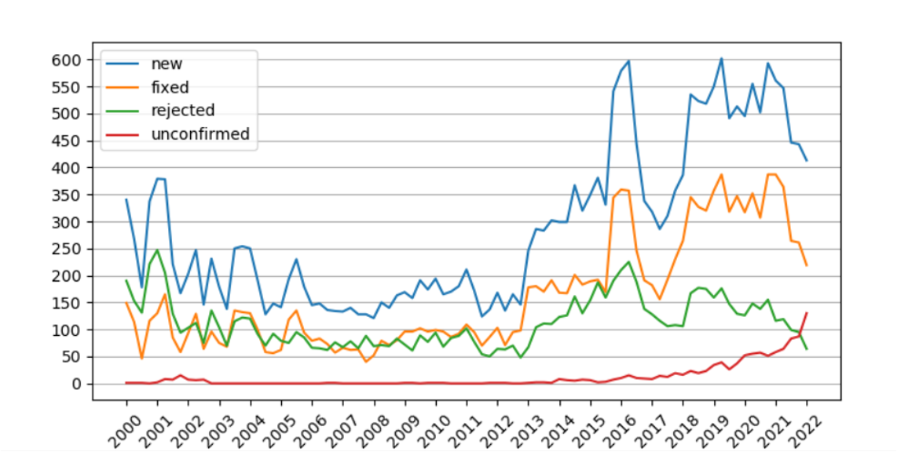
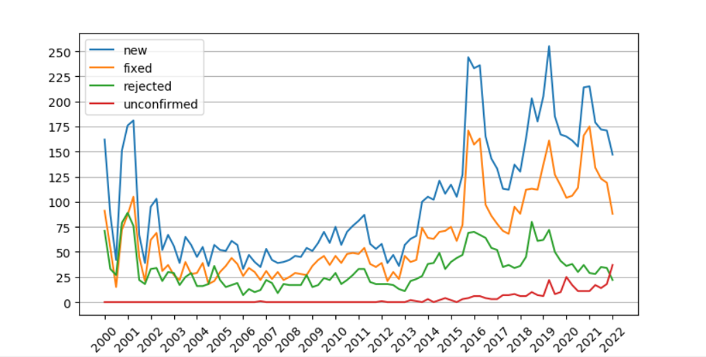

# JOpFuzzer
This is a supplementary repository for paper submission **Understanding and Detecting JVM JIT Compiler Bugs**.
## Table of Contents
  - [Confirmed Bugs](#confirmed-bugs)
  - [Empirical Study](#empirical-study)
  - [Usage of JOpFuzzer](#usage-of-jopfuzzer)
## Confirmed Bugs
Since unconfirmed bugs cannot be shown in [Java Bug System](https://bugs.openjdk.java.net/secure/Dashboard.jspa)(JBS), we only show the bugs that are confirmed by developers. Also, since the information of the reporter cannot be found in JBS, there are several screenshots of the confirmation email sent by Oracle under the directory [**Confirmed**](https://github.com/feixiangdejiahao/JOpFuzzer/tree/main/Confirmed).


| Index |Affected Versions| Bug ID | Link
|-------|-------|------|------|
| 1 | 11 |JDK-8283446|https://bugs.openjdk.java.net/browse/JDK-8283446|
| 2 | 8, 11, 18, 19|JDK-8283740|https://bugs.openjdk.java.net/browse/JDK-8283740|
| 3 | 8 |JDK-8283745|https://bugs.openjdk.java.net/browse/JDK-8283745 |
| 4 | 17, 19|JDK-8284883|https://bugs.openjdk.java.net/browse/JDK-8284883|
| 5 | 8 |JDK-8284731|https://bugs.openjdk.java.net/browse/JDK-8284731|
| 6 | 8 |JDK-8284733|https://bugs.openjdk.java.net/browse/JDK-8284733|
| 7 | 11 |JDK-8284738|https://bugs.openjdk.java.net/browse/JDK-8284738|
| 8 | 11, 17, 18, 19|JDK-8284881|https://bugs.openjdk.java.net/browse/JDK-8284881|
| 9 | 11, 17, 19|JDK-8284879|https://bugs.openjdk.java.net/browse/JDK-8284879|
| 10 |8, 11| JDK-8284882|https://bugs.openjdk.java.net/browse/JDK-8284882|
| 11 | 11, 17, 18, 19|JDK-8284951|https://bugs.openjdk.java.net/browse/JDK-8284951 |
| 12 | 8, 11, 17, 18|JDK-8284944|https://bugs.openjdk.java.net/browse/JDK-8284944 |
| 13 | 8 |JDK-8284945|https://bugs.openjdk.java.net/browse/JDK-8284945 |
| 14 | 8 |JDK-8284946|https://bugs.openjdk.java.net/browse/JDK-8284946|
| 15 | 8 |JDK-8284952|https://bugs.openjdk.java.net/browse/JDK-8284952|
| 16 | 8 |JDK-8284947|https://bugs.openjdk.java.net/browse/JDK-8284947|
| 17 | 8 |JDK-8284954|https://bugs.openjdk.java.net/browse/JDK-8284954|
| 18 | 17, 18, 19|JDK-8285301|https://bugs.openjdk.java.net/browse/JDK-8285301|
| 19 | 8 | Issue#305 |https://github.com/alibaba/dragonwell8/issues/305 |

## Empirical Study
We provide the raw data and the results in our whole study. **For easy reading, all the results are stored in the directory [figures](https://github.com/feixiangdejiahao/JOpFuzzer/tree/main/figures), only these not shown in the paper are displayed in this page**.
### Raw Data and Scripts
Raw data contains three parts: bug reports, git commit log in OpenJDK, and bug triggering input. We store the bug reports in Google Drive([JDK_data](https://drive.google.com/file/d/1SZDlTphuhT4o7r5rOKIzZaxeFMmk49X1/view?usp=sharing), [Compiler_data](https://drive.google.com/file/d/1qxPdPX1AOKuFCW-DAucOjoHNVtHgvKNj/view?usp=sharing)), git commit log in the directory [Git_commit_log](https://github.com/feixiangdejiahao/JOpFuzzer/tree/main/Scripts/Git_commit_log)
and bug triggering input in directory [Bug_triggering_input](https://github.com/feixiangdejiahao/JOpFuzzer/tree/main/Bug_triggering_input).

We use the tool in the directory [Scripts](https://github.com/feixiangdejiahao/JOpFuzzer/tree/main/Scripts) to extract the result in the empirical study. 
Users should download the JDK_data and Compiler_data and run the process.py with a proper option.
```
# cd Scripts
# wget https://drive.google.com/file/d/1SZDlTphuhT4o7r5rOKIzZaxeFMmk49X1/view?usp=sharing
# wget https://drive.google.com/file/d/1qxPdPX1AOKuFCW-DAucOjoHNVtHgvKNj/view?usp=sharing
# python3 process.py
   --priorty       get distribution of priorty
   --duration      get distribugtion of duration
   --resolution    get distribugtion of resolution
   --pd            get distribugtion of between priorty and duration day 
   --duplicate     get distribugtion of duplicate 
   --fixratio      get distribugtion of fix ratio 
   --changefile    get distribugtion of changed file number 
   --deleline      get distribugtion of deleted line number 
   --insline       get distribugtion of inserted line number 
   --affectversion get distribugtion of affected versions number 
   --comment       get distribugtion of comment number 
   --total         get Trend graph of totalnum and proportion
```
### Additional Results in Empirical Study
Here is the additional results in our whole empirical study.
The following figures display the evolution and the resolution proportion of bugs in HotSpot and Compiler
<div align=center>
<center>Figure1: The evolution and the percentage of bug resolution in HotSpot</center></div>
<div align=center>
<center>Figure2: The evolution and the percentage of bug resolution in Compiler</center></div>

The following table shows the distribution between the bug priority and the bug duration. The result reveals that compiler bugs have a higher ratio in priority P1, P2 and P3. Meanwhile, the duration days of compiler bugs corresponding to each priority is relatively short.
| | HotSpot Ratio | HotSpot Duration Days | Compiler Ratio | Compiler Duration Days |
|----|:--------------:|:---------------------:|:---------------:|:----------------------:|
| P1 | 0.06 | 68 | 0.08 | 46 |
| P2 | 0.19 | 102 | 0.21 | 82 |
| P3 | 0.33 | 155 | 0.35 | 111 |
| P4 | 0.40 | 237 | 0.33 | 169 |
| P5 | 0.02 | 426 | 0.03 | 386 |
## Usage of JOpFuzzer
**Step 1: Enviroment Setup**
JOpFuzzer needs the debug build of JVM, so users should download the source code of JVM and set the debug flag. Here we take the OpenJDK11 as an example.
```
# git clone https://github.com/openjdk/jdk11u.git
# cd jdk11u
# bash configure --enable-debug
# make images
```
If users want to test regression tests in OpenJDK or other JDKs, they also need to download JTreg and set the location of JTreg at configuration time.
```
# git clone https://github.com/openjdk/jtreg.git
# cd jtreg
# sh make/build.sh --jdk <path to JDK home>
# cd jdk11u
# bash configure --enable-debug --with-jtreg=<path to jtreg home>
# make images
```
Also, JOpFuzzer also requires some python dependencies to be installed.
+ numpy
+ pandas

**Step 2: Run the Tool**
```
# cd JOpFuzzer
# python3 main.py --help
usage: main.py [-h] JDKPath JDKVersion Benchmark

Choose the path of the JVM and the benchmark.

positional arguments:
  JDKPath     The path to the JDK tested
  JDKVersion  The version of the JDK tested (e.g., OpenJDK11. See versions in
              directory options)
  Benchmark   The benchmark used as seed (avrora, eclipse, fop, jython, pmd,
              sunflow, and regression)

optional arguments:
  -h, --help  show this help message and exit

# python3 main.py /home/jdk11u OpenJDK11 sunflow
```
