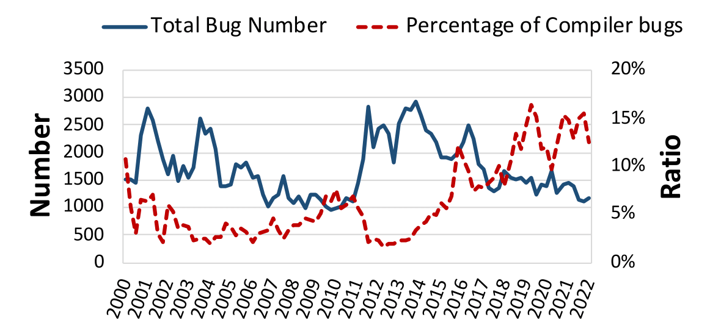
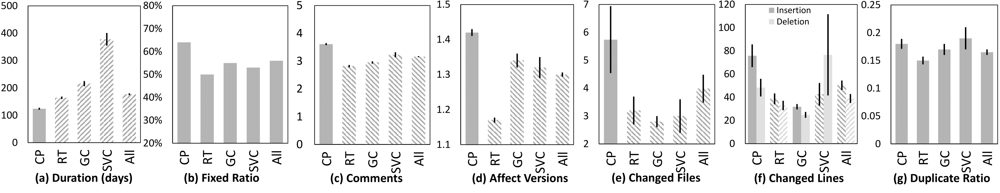
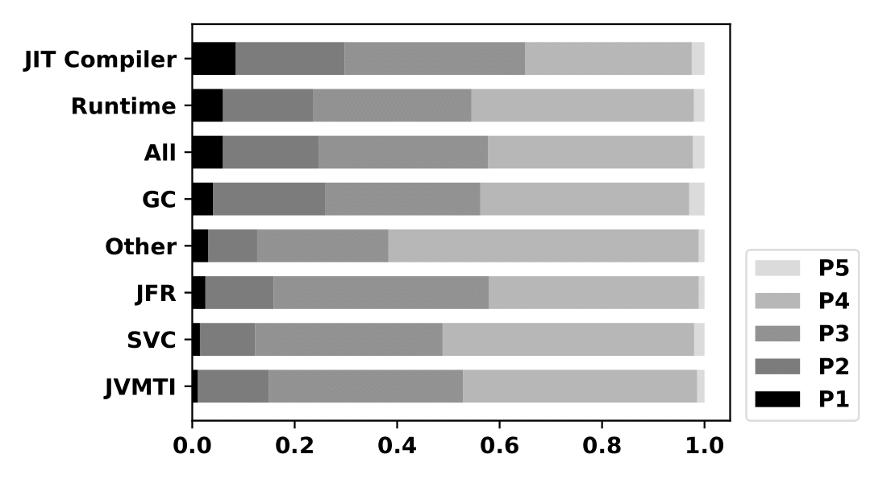
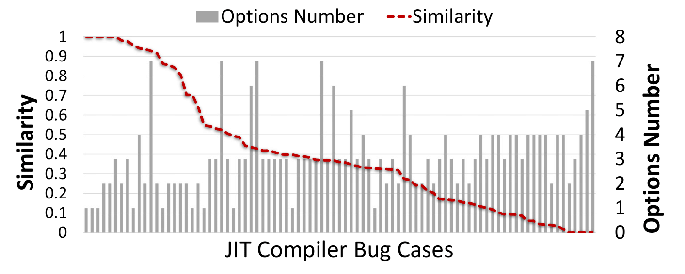
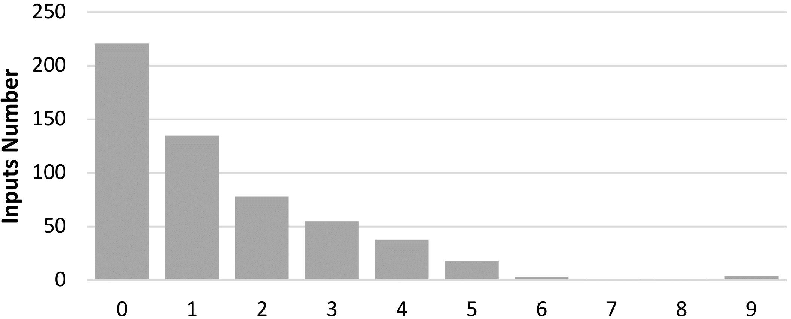

Figure1: The evolution of total number of bugs and the percentage of JIT Compiler bugs

Figure2: Bug characteristics of the major components of HotSpot

Figure3: The bug priority assigned to bugs of different components

Figure4: The distribution of option number in triggering inputs

Figure5: The similarity between the profile data before and after applying specific optimization options and the option numbers

Figure6: The evolution and the percentage of bug resolution in HotSpot

Figure7: The evolution and the percentage of bug resolution in Compiler

   

  
  
|| HotSpot Ratio | HotSpot Duration Days | Compiler Ratio | Compiler Duration Days |
|----|:--------------:|:---------------------:|:---------------:|:----------------------:|
| P1 | 0.06 | 68 | 0.08 | 46 |
| P2 | 0.19 | 102 | 0.21 | 82 |
| P3 | 0.33 | 155 | 0.35 | 111 |
| P4 | 0.40 | 237 | 0.33 | 169 |
| P5 | 0.02 | 426 | 0.03 | 386 |

Table1: The priority ratio and distribution of bug duration as well as priority

